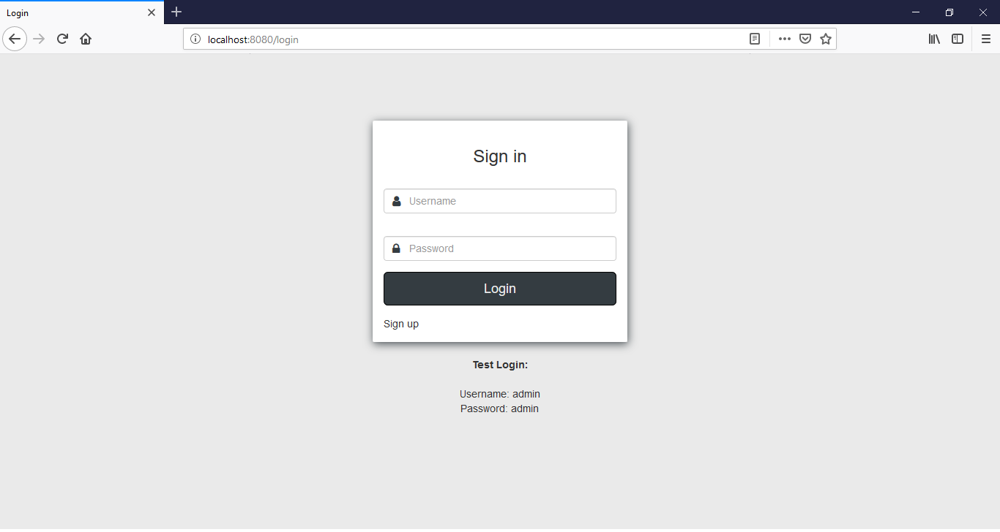
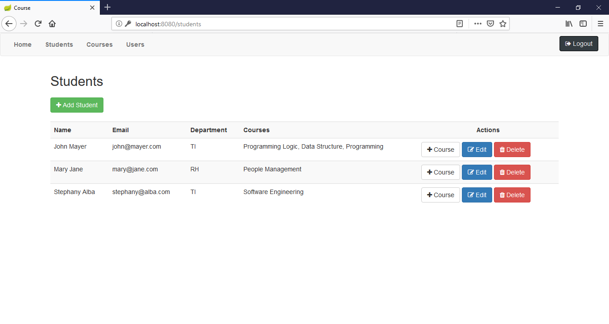
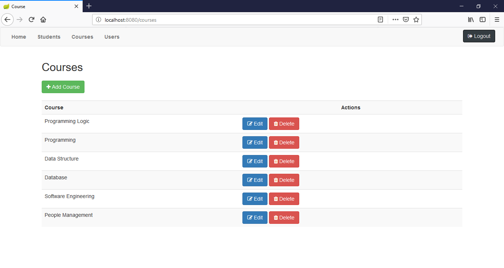
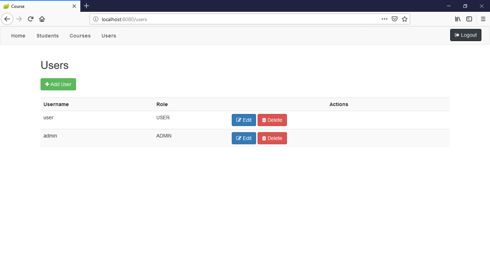
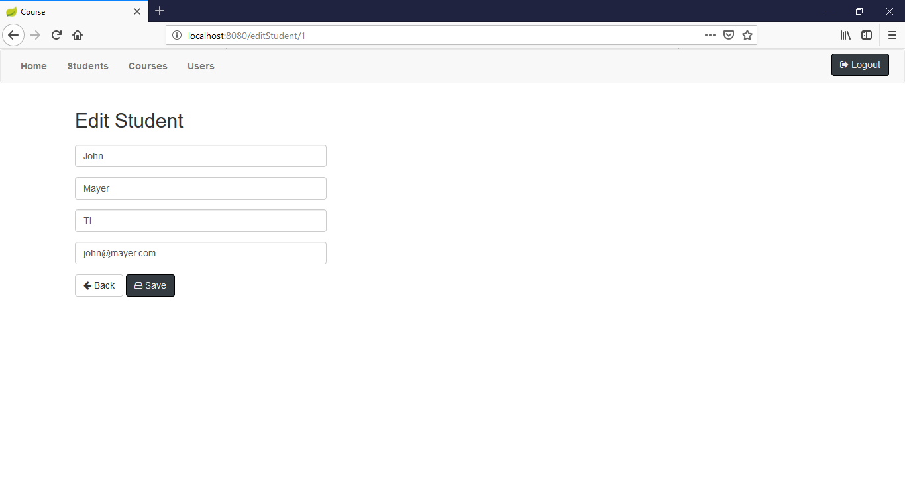
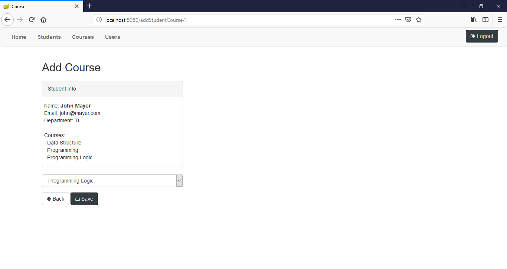
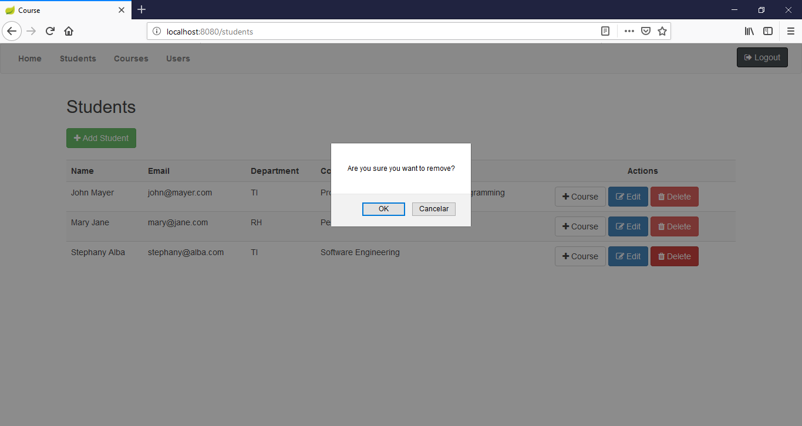
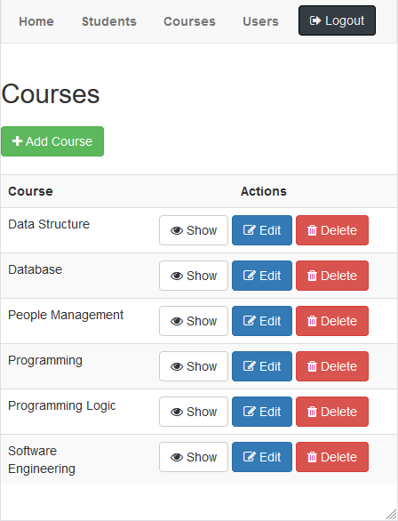
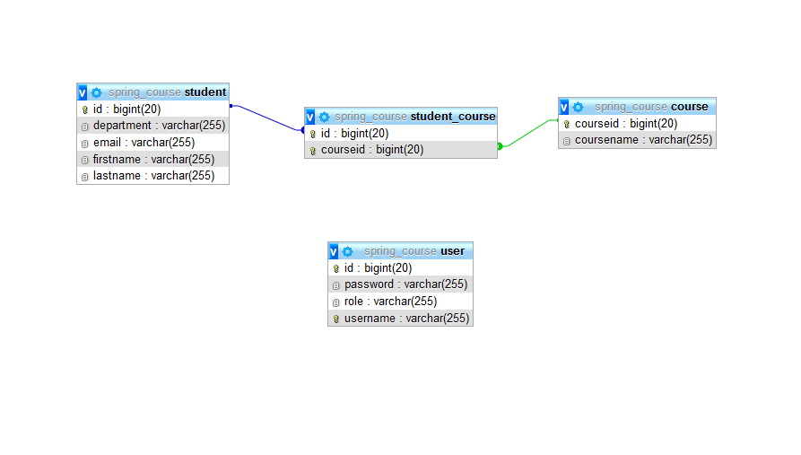

# Course

Course registration project using Java Web with Spring Framework.<br>
Spring much lighter! :)

## Features

- CRUD
- ACL
- Validation
- Login
- Responsive

## Requirements

- NetBeans 8.2
- Java JDK 1.8
- Apache Tomcat >= 9
- MySql >=5

## Tecnologies

- Java
- JPA
- Maven
- Spring
- CSS
- Bootstrap
- MySql

## Installation

```
$ git clone https://github.com/danilomeneghel/spring-course.git

$ cd spring-course

```

Then create a database with name spring_course in your mysql. You can find database dump in spring_course.sql, import it:

```
$ mysql -u <your user> -p <your password>

mysql> create database `spring_course`;

mysql> use `spring_course`;

mysql> source spring_course.sql

```

Then open the file "src/main/resources/application.properties" and enter the data according to the connection of your database. <br>

When the configuration is complete, just type in the terminal "mvn spring-boot: run" and open in your browser the following address: <br>

http://localhost:8080/

## Demonstration

https://java-spring-course.herokuapp.com/ <br>

- Login
    - Username: admin
    - Password: admin

## Licence

User Registration is licensed under <a href="LICENSE">The MIT License (MIT)</a>.

## Screenshots

<br><br>
<br><br>
<br><br>
<br><br>
<br><br>
<br><br>
<br><br>
<br><br>

## Model ER

<br><br>


Developed by<br>
Danilo Meneghel<br>
danilo.meneghel@gmail.com<br>
http://danilomeneghel.github.io/<br>
